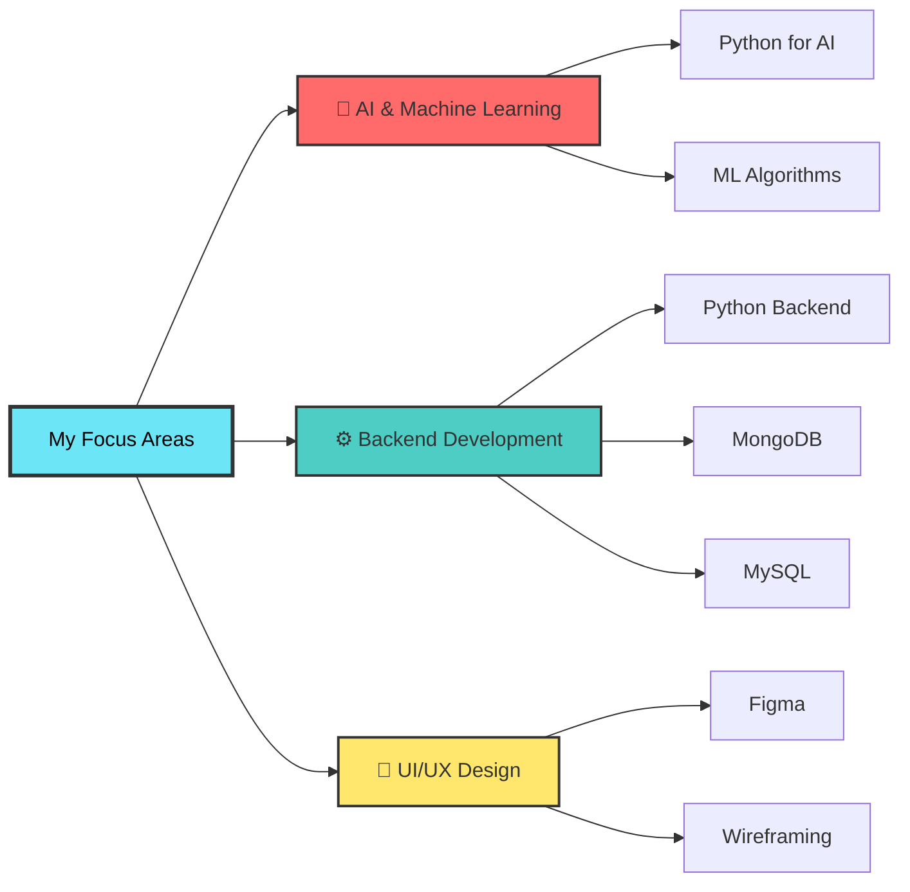

<div align="center">
  
</div>

<div align="center">
  
</div>

<br>

<div align="center">
  
</div>

## 🎯 About Me

Hey there! I'm **Poornima Prasadini**, a passionate Computing & Information Systems student based in **Negombo, Sri Lanka** 🇱🇰

🎓 **Student Developer** | 🎤 **Public Speaker** | 🤖 **AI & Backend Enthusiast**

I'm on an exciting journey of learning and building! Currently diving deep into **Artificial Intelligence** and **Backend Development**. I love creating projects that can make a positive impact on society while constantly exploring new technologies.

When I'm not coding, you'll find me traveling to new places, seeking adventures, and sharing knowledge as a public speaker. I believe in learning by doing and growing step by step!

✨ **Always open to collaboration and new opportunities!**

<br>

## 🌱 Currently Learning

<div align="center">

I'm currently focusing on **AI and Backend Development**, expanding my skills to build intelligent and scalable applications!



</div>

<br>

## 💻 Technologies I'm Familiar With

<div align="center">

### 🎨 Frontend


### ⚙️ Backend & AI


### 🗄️ Database


### 🎨 Design Tools


### 🛠️ Tools & Others


</div>

<br>

## 📊 GitHub Stats

<div align="center">
  
  
</div>

<div align="center">
  
</div>

<br>

## 🎯 My Goals

<table align="center">
<tr>
<td align="center" width="33%">

<br>
<b>Learn New Tech Trends</b>
<br>
<sub>Stay updated with the latest in technology</sub>
</td>
<td align="center" width="33%">

<br>
<b>Build Social Impact Projects</b>
<br>
<sub>Create solutions that help society</sub>
</td>
<td align="center" width="33%">

<br>
<b>Continuous Growth</b>
<br>
<sub>Improve my skills step by step</sub>
</td>
</tr>
</table>

<br>

## 🔥 Contribution Graph

<div align="center">
  
</div>

<br>

## 🌐 Connect With Me

<div align="center">
  
[](YOUR_LINKEDIN_URL)
[](YOUR_PORTFOLIO_URL)
[](mailto:YOUR_EMAIL)

</div>

<br>

## 💡 Fun Facts About Me

<div align="center">

```
✈️ I LOVE traveling and exploring new adventures
🏔️ Always up for adventurous activities
💻 But most of the time, you'll find me coding!
🎤 Enjoy sharing knowledge as a public speaker
🎨 Design wireframes and UI/UX for fun
🌍 Passionate about using tech to help society
🚀 Believe in continuous learning and growth
```

</div>

<br>

## 📈 Profile Views

<div align="center">
  
</div>

<br>

---

<div align="center">
  
  
  ### 💭 *"The best way to predict the future is to create it."* - Peter Drucker
  
  
  
  **Thanks for visiting! Feel free to connect and collaborate! 🚀**
  
  ⭐️ From [Poornima Prasadini](https://github.com/YOUR_GITHUB_USERNAME)
</div>
